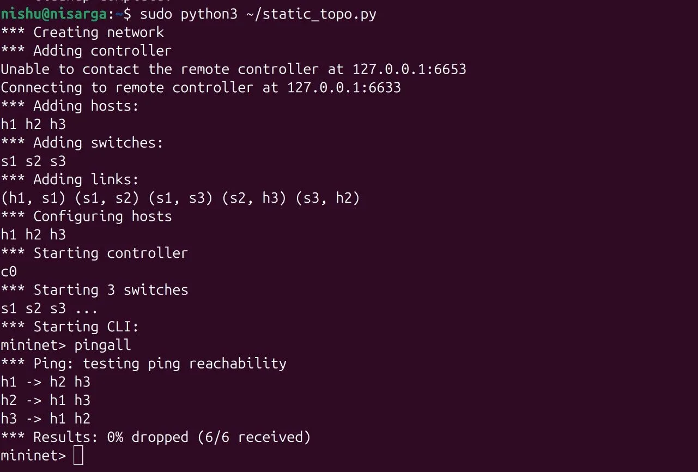
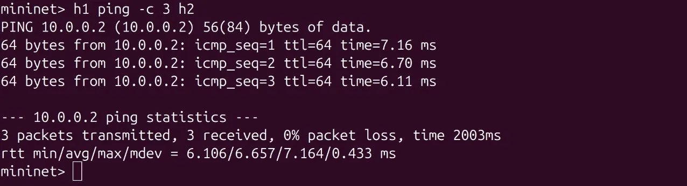
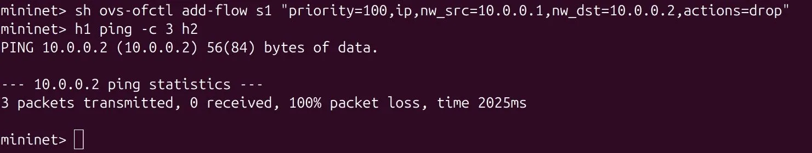
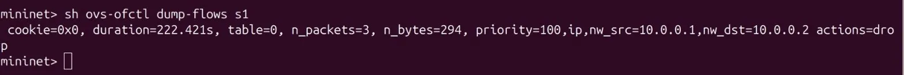
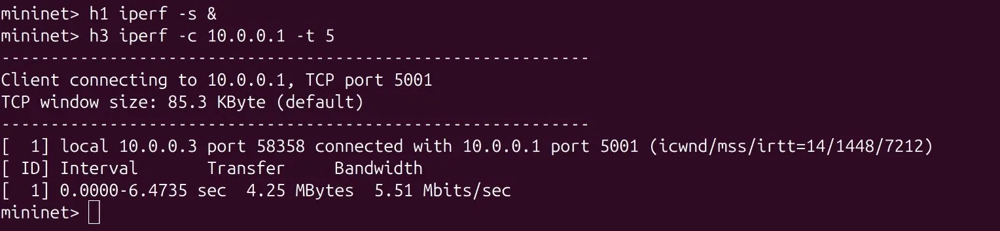
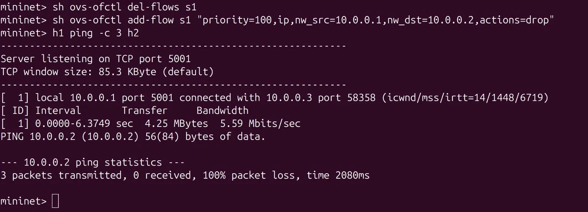

# SDN Static Routing using POX Controller and Mininet

## Problem Statement
Implement static routing paths using controller-installed flow rules in an SDN network. The controller manually installs OpenFlow rules to define exact packet forwarding paths between hosts.

## Topology
H1 --- S1 --- S2 --- H3
|
S3
|
H2
- 3 Switches: S1, S2, S3
- 3 Hosts: H1 (10.0.0.1), H2 (10.0.0.2), H3 (10.0.0.3)
- Controller: POX

## Setup & Execution Steps

### 1. Install dependencies
```bash
sudo apt install mininet openvswitch-switch git -y
git clone https://github.com/noxrepo/pox
```

### 2. Copy controller file
```bash
cp static_routing.py ~/pox/ext/
```

### 3. Run POX controller (Terminal 1)
```bash
cd ~/pox
python3 pox.py log.level --INFO static_routing
```

### 4. Run Mininet topology (Terminal 2)
```bash
sudo python3 static_topo.py
```

## Test Scenarios

### Scenario 1 - Normal Routing (Allowed)
All hosts can reach each other:
mininet> pingall
Expected: 0% packet loss

### Scenario 2 - Blocked Path (Firewall Rule)
Block H1 to H2:
mininet> sh ovs-ofctl add-flow s1 "priority=100,ip,nw_src=10.0.0.1,nw_dst=10.0.0.2,actions=drop"
mininet> h1 ping -c 3 h2
Expected: 100% packet loss

## Performance Measurement
mininet> h1 iperf -s &
mininet> h3 iperf -c 10.0.0.1 -t 5
Result: ~5.51 Mbits/sec throughput

## Regression Test
Delete and reinstall flow rules, verify behavior unchanged:
mininet> sh ovs-ofctl del-flows s1
mininet> sh ovs-ofctl add-flow s1 "priority=100,ip,nw_src=10.0.0.1,nw_dst=10.0.0.2,actions=drop"
mininet> h1 ping -c 3 h2
Expected: Still 100% packet loss

## Expected Output
- pingall: 0% dropped (6/6 received)
- Blocked ping: 100% packet loss
- iperf: ~5.51 Mbits/sec

## References
- https://mininet.org/overview/
- https://github.com/noxrepo/pox
- https://opennetworking.org/sdn-definition/
## Proof of Execution

### Scenario 1 - pingall (all hosts reachable)


### Scenario 2 - H1 ping H2 before block


### Scenario 2 - H1 ping H2 after block


### Flow Table dump


### iperf performance test


### Regression Test

